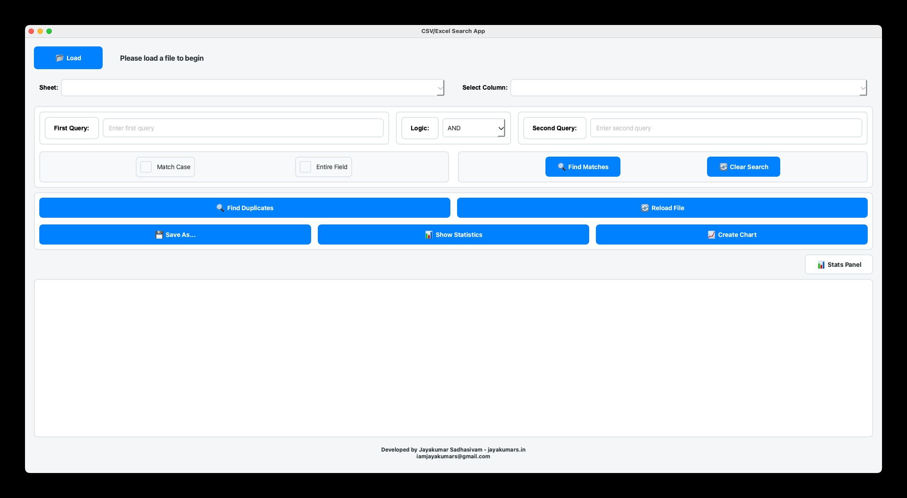

# CSV/Excel Search App

A powerful desktop application for searching, analyzing, and visualizing data in CSV and Excel files.

## Features

- 🔍 Advanced search functionality with multiple queries and logic operators (AND, OR, NOT)
- 📊 Data visualization with various chart types (Bar, Line, Pie, Scatter)
- 🔍 Duplicate detection and highlighting
- 📈 Statistical analysis and reporting
- 💾 Export data in multiple formats (CSV, Excel, JSON, PDF)
- 📑 Support for multiple Excel sheets
- 🎨 Modern and intuitive user interface
- 📊 Real-time statistics and progress tracking

## Installation

### For Windows Users
1. Download the latest release from the Releases page
2. Run the `CSV_Search_App.exe` file
3. No additional installation required

### For Developers
1. Clone the repository
2. Install Python 3.8 or higher
3. Install dependencies:
   ```bash
   pip install -r requirements.txt
   ```
4. Run the application:
   ```bash
   python Code_V1.py
   ```



## Usage

1. Click "Load" to open a CSV or Excel file
2. Use the search boxes to enter your search queries
3. Select search options (Match Case, Entire Field)
4. Choose the logic operator (AND, OR, NOT)
5. Click "Find Matches" to search
6. Use "Clear Search" to reset the search
7. Export results or create visualizations as needed

## Requirements

- Windows 10/11
- For development:
  - Python 3.8+
  - Dependencies listed in requirements.txt

## Contributing

Contributions are welcome! Please feel free to submit a Pull Request.

## License

This project is licensed under the MIT License - see the LICENSE file for details.

## Author

Jayakumar Sadhasivam
- Website: jayakumars.in
- Email: iamjayakumars@gmail.com

## Acknowledgments

- PyQt6 for the GUI framework
- pandas and polars for data handling
- matplotlib and seaborn for visualization
- All other open-source libraries used in this project 
